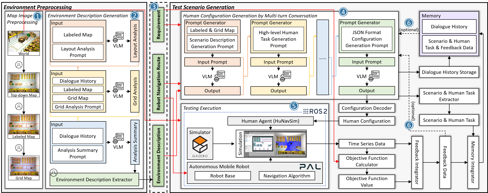

# Vision Language Model-based Testing of Industrial Autonomous Mobile Robots

## Abstract
Autonomous Mobile Robots (AMRs) are deployed in diverse environments (e.g., warehouses, retail spaces, and offices), where they work alongside humans. Given that human behavior can be unpredictable and that AMRs may not have been trained to handle all possible unknown and uncertain behaviors, it is important to test AMRs under a wide range of human interactions to ensure their safe behavior. Moreover, testing in real environments with actual AMRs and humans is often costly, impractical, and potentially hazardous (e.g., it could result in human injury). To this end, we propose a Vision Language Model (VLM)-based testing approach (RVSG) for industrial AMRs developed by PAL Robotics in Spain. Based on the functional and safety requirements, RVSG uses the VLM to generate diverse human behaviors that violate these requirements. We evaluated RVSG with several requirements and navigation routes in a simulator using the latest AMR from PAL Robotics. Our results show that, compared with the baseline, RVSG can effectively generate requirement-violating scenarios. Moreover, RVSG-generated scenarios increase variability in robot behavior, thereby helping reveal their uncertain behaviors.



## Setup
1. TIAGO OMNI Base ROS 2 Simulation: https://github.com/pal-robotics/omni_base_simulation
2. Human Navigation behavior Simulator (HuNavSim): https://github.com/robotics-upo/hunav_sim
3. Build the python environment:
```
conda env create -f environment.yaml
```
4. Set map folder
```
cp -r generatedWorld /opt/ros/humble/share/pal_maps/maps
```

## How to run
1. Source simulation environment:
```
export PATH=/usr/bin:$PATH
source /usr/share/gazebo/setup.sh
colcon build --symlink-install
source install/setup.bash
```
2. Run _Environment Preprocessing_ and _Test Scenario Generation_:
```
ros2 run test_pal_robotics test_hunav
```
3. Repeat scenarios:
```
ros2 run test_pal_robotics test_best_scenario
```
4. Analyze and obtain results:
```
python ./src/test_pal_robotics/test_pal_robotics/analyze.py
```
All the outputs and results are saved in _/output_.
